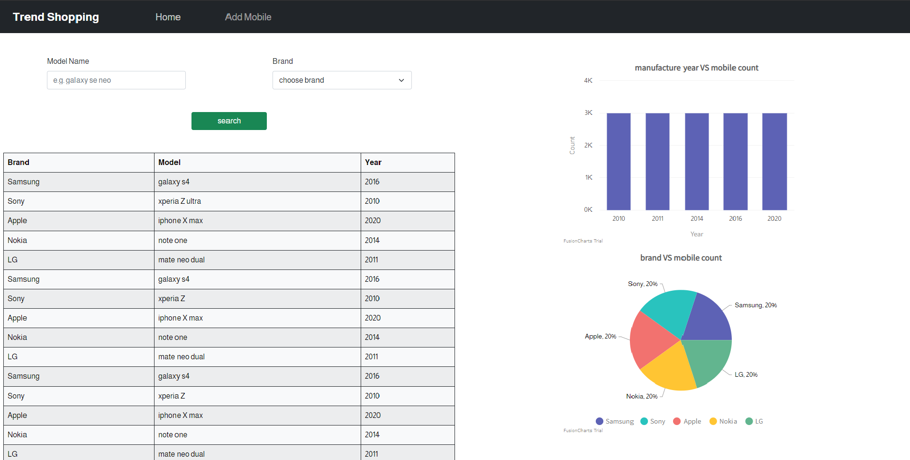
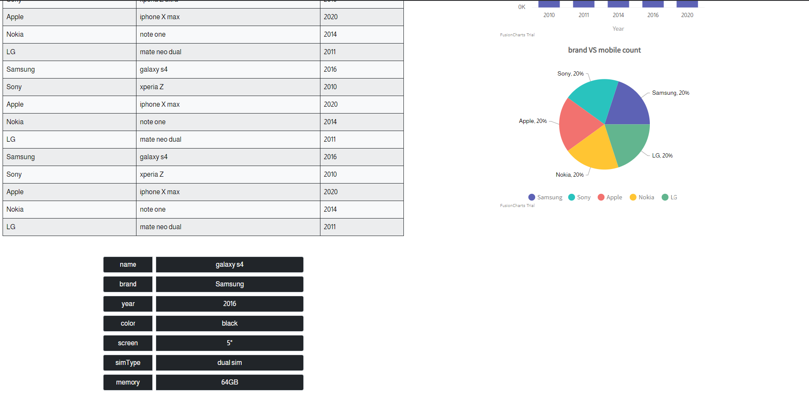
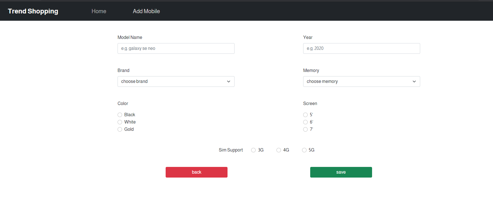

## Description

> trend-shopping is A simple website that enables user to add modiles in a table and search for them by brand and/or model name, it also contains two types of charts to provide overview for the data currently in the system

## Built with

### 1. ReactJS

### 2. Bootstrap

### 3. Fusioncharts

## Usage

### open new terminal and run following commands

    git clone https://github.com/tarek99samy/trend-shopping.git
    cd trend-shopping
    npm i
    npm run dev

#### make sure you already installed Node & npm to latest version before starting

## Screenshots

### Home page

### Add new mobile page

